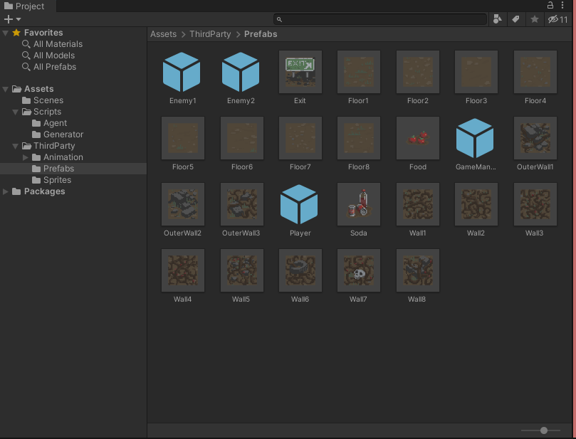
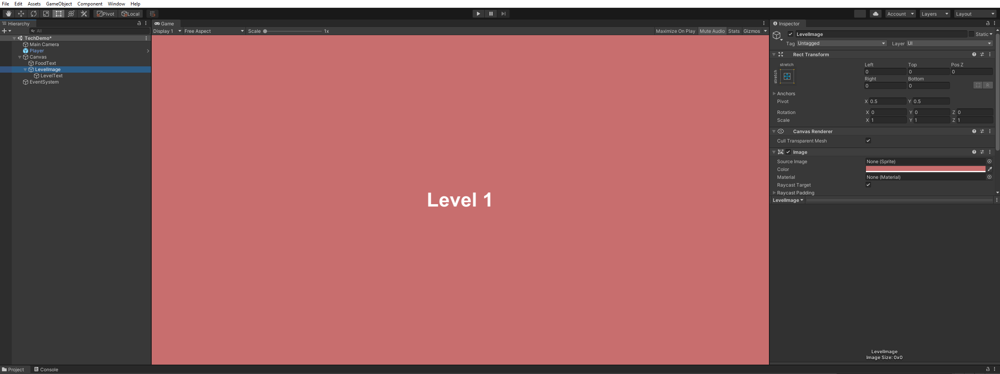
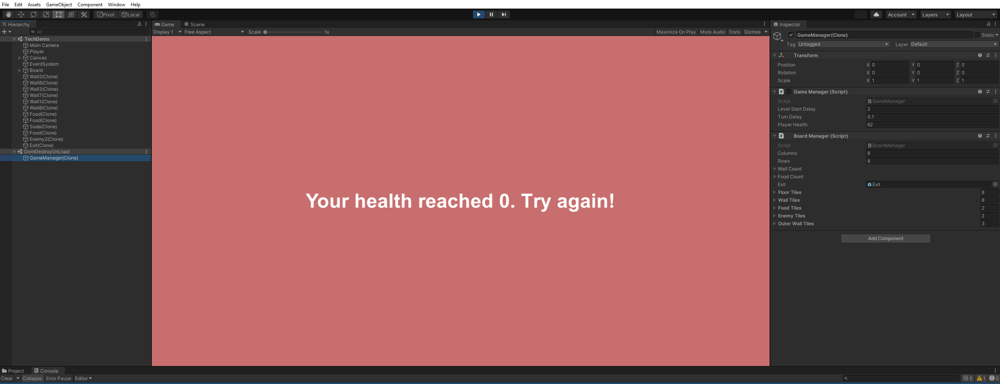
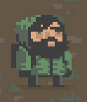
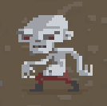

# Zombie Run 🧟

## Video Demonstration 📽

* The video demonstration is available to view [here](https://youtu.be/d3jD6NM5CLE).

<p align="center">
    
</p>

## Introduction 📰

* **This mini-game was built as a project for the Interactive Agents and Procedural Generation (ECS7016P) module at Queen Mary, University of London**.
* The aim of the game is to complete the maximum number of levels without the health reaching 0.
* Food items can be collected to replenish the health.
* The interaction of the player with the enemy or the boundary walls of the game result in a decrease in the health of the player. 

### Game structure 

```commandline
📦Assets
 ┣ 📂Scenes                         // Main Scene
 ┃ ┗ 📜TechDemo.unity                   
 ┣ 📂Scripts                        // Player and enemy definitions
 ┃ ┣ 📂Agent                        
 ┃ ┃ ┣ 📜Enemy.cs
 ┃ ┃ ┗ 📜Player.cs
 ┃ ┣ 📂Generator                    // Procedural level generation
 ┃ ┃ ┣ 📜BoardManager.cs
 ┃ ┃ ┣ 📜GameManager.cs
 ┃ ┃ ┣ 📜Loader.cs
 ┃ ┃ ┣ 📜MovingObject.cs
 ┃ ┃ ┗ 📜Wall.cs
 ┣ 📂ThirdParty                     // Animations and character skins
 ┃ ┣ 📂Animation
 ┃ ┃ ┣ 📂Animations
 ┃ ┃ ┗ 📂AnimatorControllers
 ┃ ┣ 📂Prefabs
 ┗ ┗ 📂Sprites
```

### Setup

* This project was developed on Unity version `2020.3.32f1`.
* Drag and drop the `TechDemo.unity` scene into the `Project` window from `Assets/Scenes/TechDemo.unity`.
* The dependencies will be loaded and the scene can be run.

## Procedural Generation 🎮

### Level generation

* The levels are generated on an `8 x 8` board consisting of different texture tiles located in the `📂Prefabs` folder.

<p align="center">
    
</p>
<p align="center">
    <b>Fig. 1: Prefabs for the level generation</b>
</p>

* The levels are procedurally generated using [Cellular Automation](https://mathworld.wolfram.com/CellularAutomaton.html) until the player dies i.e., runs out of health.

<p align="center">
    
</p>
<p align="center">
    <b>Fig. 2: Loading screen</b>
</p>

* Each level loads for 3 seconds with a placeholder image to indicate the level number..

<p align="center">
    
</p>
<p align="center">
    <b>Fig. 3: End screen</b>
</p>

* When the player's health reaches zero, the game ends.

### Food generation

* The food regenerates the player's health by 20 points per each item. 
* The placement of the food items is randomised within the game environment.

## Interactive Agents 🕴

#### Player

<p align="center">
    
</p>
<p align="center">
    <b>Fig. 4: Player character</b>
</p>

* The player can be controlled by using the keyboard arrow keys.
* The player starts off with 50 points of health that reduces every second by 2 points when the player moves.
* The health only reduces when the player, either moves or is attacked by an enemy.
* The health can be regenerated by consuming food scattered around the map.

#### Enemies

<p align="center">
    
</p>
<p align="center">
    <b>Fig. 4: Enemy character</b>
</p>

* The enemies follow the player using a simple navigation algorithm. 
* The author *tried* to leverage the [A* Pathfinding](https://arongranberg.com/astar/) library but due to the procedural generation of each level, the task could not be accomplished.

## Third-party libraries 🆘

<p align="center">
    
</p>

* The sprites, prefabs, and animations were imported from the [2D Roguelike](https://assetstore.unity.com/packages/templates/tutorials/2d-roguelike-29825) package.

## Suggested Improvements 🦾

* Different procedural generation techniques can be used to produce the level texture tiles and food.
* The movement of the zombies can be enhanced by using a more advanced navigation algorithm i.e., Behaviour Trees, A* Pathfinding and Path Planning.


 
