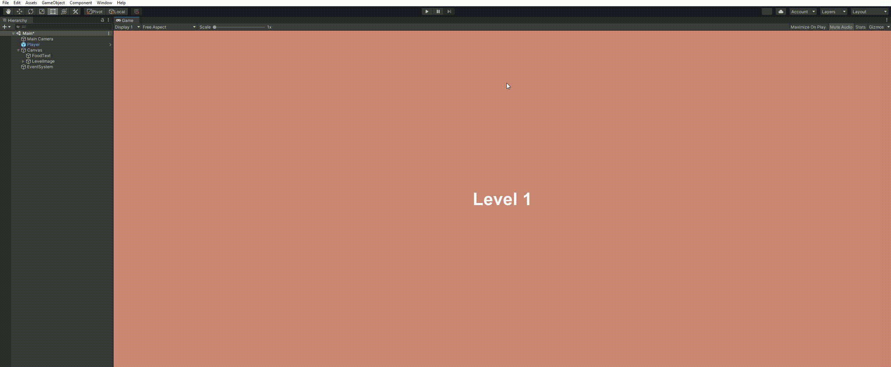
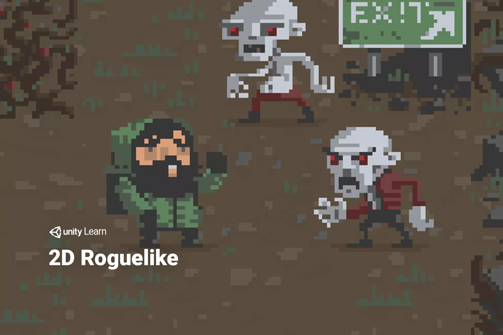

# Zombie Run 🧟

## Video Demonstration

* The video demonstration is available to view [here](https://youtu.be/d3jD6NM5CLE).

<p align="center">
    
</p>

## Introduction

* This mini-game was built as a project for the Interactive Agents and Procedural Generation (ECS7016P) module at Queen Mary, University of London.
* The aim of the game is to complete the maximum number of levels without the health reaching 0.
* Food items can be collected to replenish the health.
* The interaction of the player with the enemy or the boundary walls of the game result in a reduction in the health of the player. 

### Game structure

```commandline
📦Assets
 ┣ 📂Scenes                         // Main Scene
 ┃ ┗ 📜TechDemo.unity                   
 ┣ 📂Scripts
 ┃ ┣ 📂Agent                        // Player and enemy functionality
 ┃ ┃ ┣ 📜Enemy.cs
 ┃ ┃ ┗ 📜Player.cs
 ┃ ┣ 📂Generator                    // Level production using procedural generation
 ┃ ┃ ┣ 📜BoardManager.cs
 ┃ ┃ ┣ 📜GameManager.cs
 ┃ ┃ ┣ 📜Loader.cs
 ┃ ┃ ┣ 📜MovingObject.cs
 ┃ ┃ ┗ 📜Wall.cs
 ┣ 📂ThirdParty                     // Animations and character skins
 ┃ ┣ 📂Animation
 ┃ ┃ ┣ 📂Animations
 ┃ ┃ ┗ 📂AnimatorControllers
 ┃ ┣ 📂Prefabs
 ┗ ┗ 📂Sprites
```

### Setup

* Drag and drop the `TechDemo.unity` scene into the `Hierarchy` window.
* The dependencies will be loaded and the scene can be then run.

## Procedural Generation

### Level generation

* The levels are generated on a `8 x 8` tile. 

* Show levels, screenshots, show ending 

### Food generation

## Interactive Agents

#### Player

* The player can be controlled by using the keyboard arrow keys.

#### Enemies

## Third-party libraries

<p align="center">
    
</p>

* The sprites, prefabs, and animations were imported from the [2D Roguelike package](https://assetstore.unity.com/packages/templates/tutorials/2d-roguelike-29825).

## Suggested Improvements

* The movement of the zombies
* Character animations
* 

## Conclusion

 
